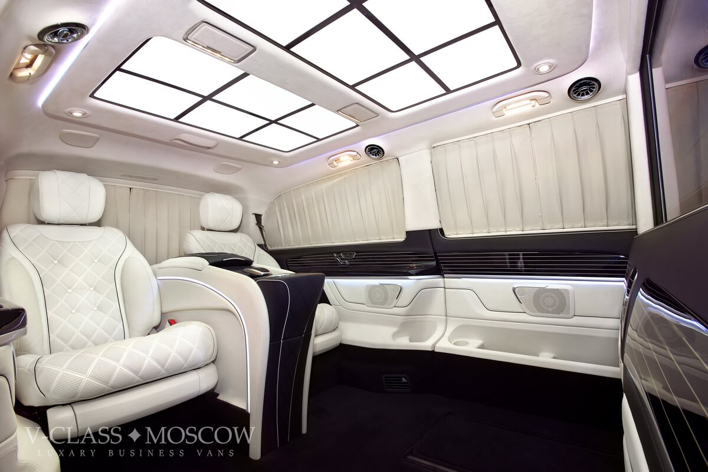
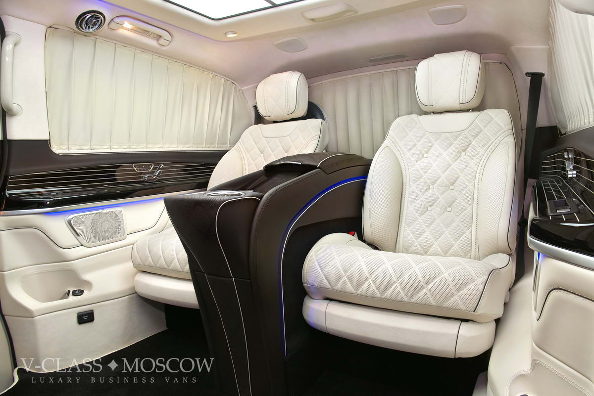
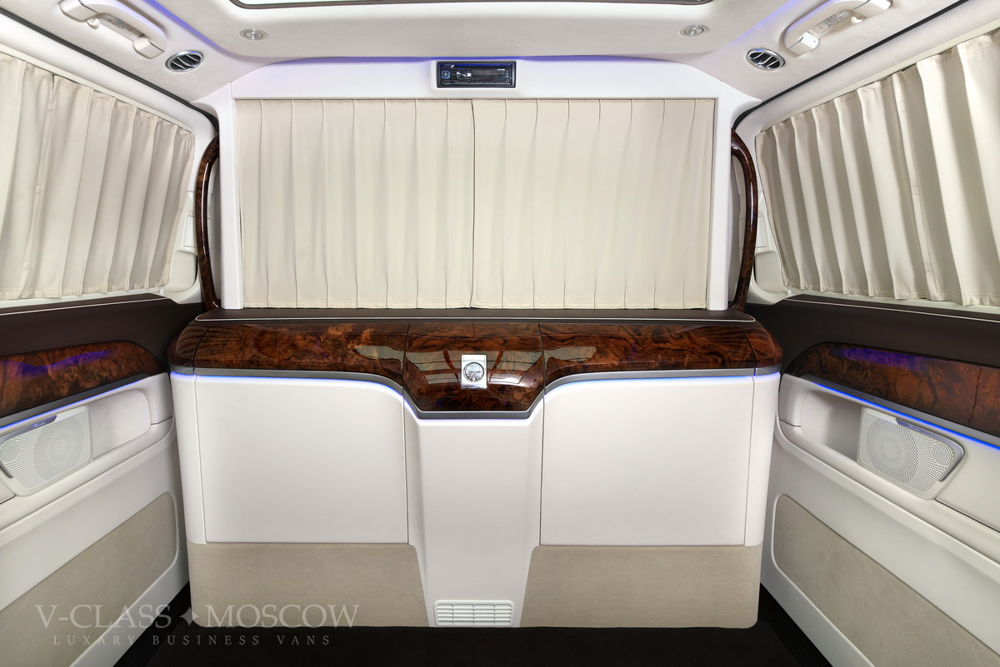

## О компании

С 2015 года мы производим переоборудованные автомобили Mercedes-Benz V-класса мелкосерийно в Москве. Мы постоянно расширяем набор опций по переоснащению офисов на колёсах, а также совершенствуем наши технологии и рабочие процессы. Мы работаем с частными и юридическими лицами.
Вы можете купить как готовый автомобиль с нужным набором опций, так и подвергнуть переоборудованию ваш автомобиль.
Рабочий процесс процесса переоборудования автомобиля представлен из диаграмме ниже. Для определения состава работ нужно воспользоваться списком опций.

Мы имеем большой опыт по созданию офисов на колёсах. Наши автомобили — комфортабельные передвижные кабинеты оборудованные всеми необходимыми системами и имеющие респектабельный вид. Комплекс работ по дооснащению и модификации включает следующие опции:

- Моторизированная перегородка &laquo;пассажир&mdash;водитель&raquo;, отделяющие пространство пассажиров от переднего ряда сидений.
- Высококомфортабельные сидения, обладающие большим количеством моторизированных регулировок положения и формы сидения, функциями массажа, подогрева и памятью настроек.
- Трансформируемые выдвигаемые столики для создания рабочего места с ноутбуком или документами.
- Специальные консоли управления всей электроникой в салоне пассажиров.
- Перетяжка и отделка салона с использованием высококачественных материалов и современных технологий.
- Hi-End аудио- и видеосистема в салоне.
- Точки доступа Wi-Fi, работающей одновременно с несколькими SIM-картами.
- Проводные и беспроводные зарядные устройства для мобильных телефонов и планшетов.
- Потайные ящички и отсеки.

### Контакты

- Телефон: +7 495 507-72-57
- am@v-class.moscow
- Москва, 125413, Головинский район, ул. Солнечногорская, дом 4, строение 13

### Данные о юрлице
© 2015—2020 ООО «Комфорт-Плюс»